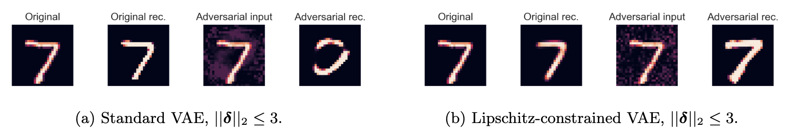

<head>
    <link rel="stylesheet" href="/font-awesome-4.7.0/css/font-awesome.min.css">
</head>

**Certifiably Robust Variational Autoencoders** ([<i class="fa fa-file-pdf-o" aria-hidden="true"></i>](https://proceedings.mlr.press/v151/barrett22a/barrett22a.pdf))    
(with Alex Camuto, Matthew Willetts, and Tom Rainforth)  
_International Conference on Artificial Intelligence and Statistics (AISTATS), 2022_  

